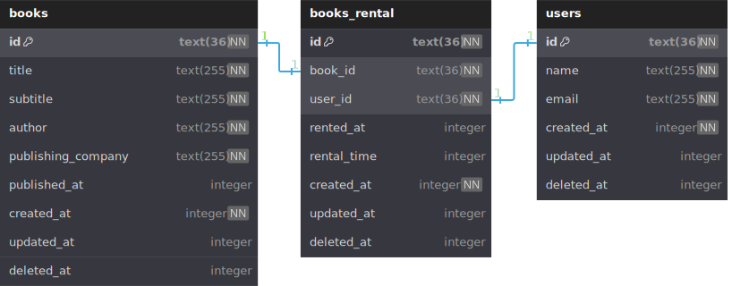

# Bookstore API

The Bookstore API is a study project focused on Test-Driven Development (TDD). It provides HTTP endpoints for managing books, book rentals, and user information.

This project was developed as part of the final test of the TDD module provided by [Ada tech](https://ada.tech/) in collaboration with iFood.

## 💻 Technologies

- [Typescript](https://www.typescriptlang.org/)
- [Express](https://github.com/expressjs/express)
- [TSX](https://github.com/privatenumber/tsx)
- [Tsup](https://tsup.egoist.dev/)
- [BiomeJS](https://biomejs.dev/)
- [Drizzle ORM](https://orm.drizzle.team/)
- [Vitest](https://vitest.dev/)
- [Zod](https://zod.dev/)

## Installation

To install the project and its dependencies, follow these steps:

### Prerequisites

Before install the project, make sure you have the following tools installed:

- [NodeJS](https://nodejs.org/)
- [Git](https://git-scm.com/)

Now, follow the steps below to use the project:

1. **Clone the Repository:**

   ```bash
    git clone https://github.com/DavidWesley/ifood-bookstore-api-tdd bookstore-api

    cd bookstore-api
   ```

2. **Navigate to the Project Directory:**

   ```bash
   cd your-project
   ```

3. **Install Dependencies:**
   ```bash
   npm install
   ```
4. **Run migrations:**
   ```bash
   cd src/db/
   npx tsx migrate.ts
   ```

## Usage

There are two ways to run the project, each serving a different purpose:

#### Development Mode

This mode is suitable for active development, providing features like hot-reloading and enhanced debugging tools.

1. **Run in development mode:**

   ```bash
   npm run dev
   ```

2. **Access the Application:**
   - Open your browser and go to **[http://localhost:3000](http://localhost:3000)**.

#### Build Mode

1. **Build the project:**
   ```bash
   npm run build
   ```
2. **Start in build mode:**
   ```bash
   npm start
   ```
3. **Access the Application:**
   - Open your browser and go to **[http://localhost:3000](http://localhost:3000)**.

This mode optimizes the project for production, ~~maybe~~ ensuring better performance.

## Running Tests

To run tests for the project, use the following commands:

1. **Run Tests:**
   ```bash
   npm run test
   ```
2. **Generate Coverage Report:**
   ```bash
   npm run test:coverage
   ```
3. **Run Tests in Watch Mode:**
   ```bash
   npm run test:watch
   ```
   These commands will execute the tests, generate a coverage report (optional), and run tests in watch mode for continuous testing.

## Scripts

The following scripts are available:

- `npm test`: Run tests.
- `npm run test:watch`: Run tests in watch mode.
- `npm run test:coverage`: Generate test coverage report.
- `npm run lint`: Run linting checks.
- `npm run format`: Format code.
- `npm start`: Start the server in production mode.
- `npm run dev`: Start the server in development mode.
- `npm run build`: Build the project.

## 📍 API Routes

The tables below provide a summary of the main API routes.
For additional details on each route, please refer to [Routes.md](./docs/Routes.md).

### Users Routes

| Route           | HTTP Method | Description                                           |
| --------------- | ----------- | ----------------------------------------------------- |
| `/v1/users`     | GET         | Retrieves a list of all users.                        |
| `/v1/users/:id` | GET         | Retrieves detailed information about a specific user. |
| `/v1/users`     | POST        | Creates a new user based on the provided data.        |
| `/v1/users/:id` | PUT         | Updates information for a specific user.              |
| `/v1/users/:id` | DELETE      | Removes a specific user.                              |

### Books Routes

| Route           | HTTP Method | Description                                           |
| --------------- | ----------- | ----------------------------------------------------- |
| `/v1/books`     | GET         | Retrieves a list of all books.                        |
| `/v1/books/:id` | GET         | Retrieves detailed information about a specific book. |
| `/v1/books`     | POST        | Creates a new book based on the provided data.        |
| `/v1/books/:id` | PUT         | Updates information for a specific book.              |
| `/v1/books/:id` | DELETE      | Removes a specific book.                              |

### Book Rentals Routes

| Route                  | HTTP Method | Description                                                  |
| ---------------------- | ----------- | ------------------------------------------------------------ |
| `/v1/rental/books`     | GET         | Retrieves a list of all book rentals.                        |
| `/v1/rental/books/:id` | GET         | Retrieves detailed information about a specific book rental. |
| `/v1/rental/books`     | POST        | Creates a new book rental based on the provided data.        |
| `/v1/rental/books/:id` | PUT         | Updates information for a specific book rental.              |
| `/v1/rental/books/:id` | DELETE      | Removes a specific book rental.                              |

Refer to [Routes.md](./docs/Routes.md) for detailed documentation on each route.


## Entity Relationship




The most updated version of the image above can be found at [Diagrama](https://dbdiagram.io/d/Bookstore-api-tdd-db-relations-65ee4699b1f3d4062c933a67)

## Contributors

I appreciate all the individuals who have contributed to this project! 🙌

- [@DavidWesley](https://github.com/DavidWesley) David Wesley
- [@lgsrocha](https://github.com/lgsrocha) Lucas Rocha
- [@Alan-Vasconi](https://github.com/Alan-Vasconi) Alan Vasconi
- [@daniellabernardino](https://github.com/daniellabernardino) Daniella Maria
